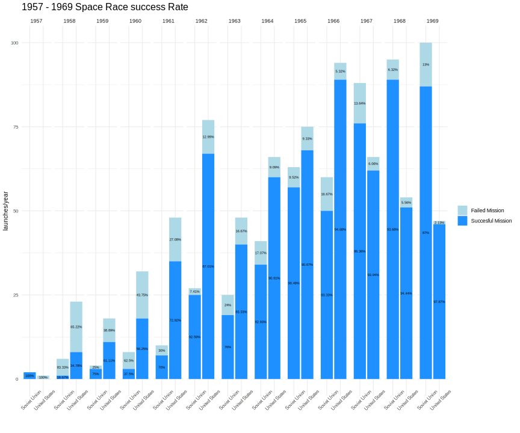
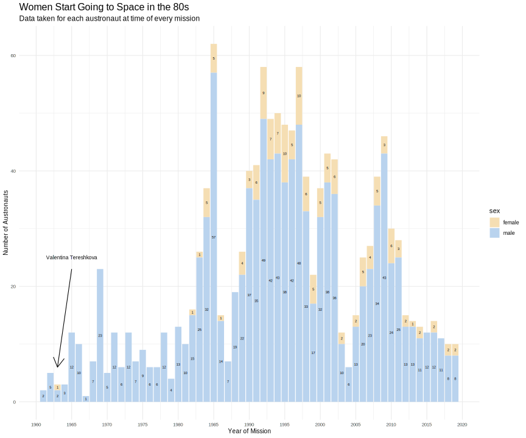
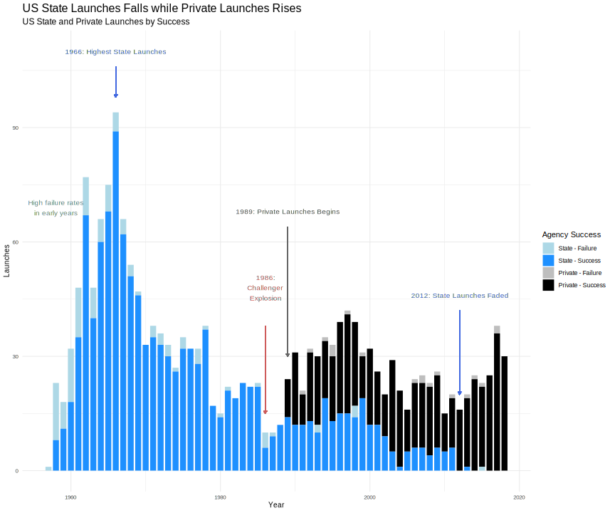

```{r}
knitr::opts_chunk$set(
  echo = FALSE,
  message = FALSE,
  warning = FALSE,
  results = FALSE,
  knitr::opts_knit$set(root.dir = getwd())
)

```


```{r figure details}

title.size <- 16
subtitle.size <- 12
axis.title.size <- 10
axis.text.size <- 8


```


```{r setup}
library(flexdashboard)
```

```{r libraries, echo=FALSE}
library(bslib)
library(skimr)
library(vroom)
library(tidyverse)
library(dplyr)
library(ggthemes)
library(gghighlight)
library(plotly)
library(patchwork)
library(countrycode)
library(jpeg)
library(png)
library(grid)
library(svglite)
library(viridis)

```

```{r echo=FALSE}

astronauts <- vroom('https://raw.githubusercontent.com/rfordatascience/tidytuesday/master/data/2020/2020-07-14/astronauts.csv')

launches <- vroom("https://raw.githubusercontent.com/rfordatascience/tidytuesday/master/data/2019/2019-01-15/launches.csv")

agencies <- vroom("https://raw.githubusercontent.com/rfordatascience/tidytuesday/master/data/2019/2019-01-15/agencies.csv")

mission_success <- vroom(here::here("data","Space_Corrected.csv"))
```


```{r echo=FALSE, include=FALSE}
mission_success <- select(mission_success, -c(1,2))

mission_success <- mission_success %>% 
  janitor::clean_names() %>% 
  mutate(datum = as.Date(mission_success$Datum, format = "%a %b %d, %Y"))


launches <-  launches %>% 
  left_join(mission_success, by = c("launch_date" = "datum"))
```

```{r, echo=FALSE, include=FALSE}
country_names <- c(US = "United States",
                'F'  = "France",
                BR = "Brazil",
                CN = "China",
                I = "italy",      
                'I-ESA' = "European Space Agency",
                RU  = "Russia",
                IR = "Iran",
                IL = "Isreal",
                J = "Japan",
                IN = "India",
                KR = "North Korea",
                KP = "South Korea",
                SU = "Soviet Union",
                UK = "United Kingdom",
                CYM = "Cayman Islands",
                'I-ELDO' = "European Launcher Development Organisation")  


country_colors <- c(US = "lightblue",
                    'F'  = "skyblue",
                    BR = "limegreen",
                    CN = "red3",
                    I = "lightgreen",      
                    'I-ESA' = "plum1",
                    RU  = "tomato",
                    IR = "lightgoldenrod",
                    IL = "tan2",
                    J = "mistyrose",
                    IN = "",
                    KR = "red",
                    KP = "South Korea",
                    SU = "tomato",
                    UK = "blue",
                    CYM = "orange",
                    'I-ELDO' = "sienna")


launches <- launches %>% 
  mutate(country_name = country_names[state_code])

launches <- launches %>% 
  mutate(agency = case_when(is.na(agency) ~ state_code,
                            TRUE ~ agency))

```
# Introduction

## Column 1 

### Introduction


<center>
<font size="+6">
<br>
<br>
<br>
<br>
<br>
**To Infinity and Beyond** - Stories from Space and about Astronauts
<br>
<br>
</font>
</center>

<center>
<font size="+2">
*Authors: * *Kazmer Nagy-Betegh, Nisa Ozer, Lauren Wade, Chandrima Tolia, Nereid Kwok, Thomas Giannetti*
</font>
</center>


# Countries Launching Rockets {data-navmenu="Space Race"}

## Column 1

>Let us look at the number of launches by Country. You can see a seperation between the US and Soviet Union, launching significantly more during the cold war. These two countries kickstarted space exploration during the sixties so let us look at that weird and exciting time.

### Launches by Countries


```{r space_race1, fig.height= 5, fig.width= 11, fig.align='center'}

launches %>% 
  filter(country_name == "NA")

space_race <- launches %>% 
  # filter(state_code %in% c("US", "SU", "RU")) %>% 
  group_by(launch_year, country_name) %>% 
  summarise(state_code, country_name, num_launches = n()) %>% 
  ungroup()
  


launchs_per_year_US_SU <- space_race %>% 
  filter(state_code %in% c("US", "SU", "RU")) %>% 
  ggplot( aes(x = launch_year,
              y = num_launches))+
  geom_point(aes(color = country_name))+
  geom_line(aes(color = country_name))+
  gghighlight(state_code %in% c("US","SU","RU"))+
  theme_minimal()+
  labs(title = "United States and Soviet Union (Russia) Space Race",
       x = "",
       y = "launches/year")+
  scale_color_manual(values = c("tomato","tomato", "lightblue"))


launchs_per_year_non_us_su <- space_race %>% 
  ggplot(aes(x = launch_year,
              y = num_launches))+
  geom_point(aes(color = country_name))+
  geom_line(aes(color = country_name))+
  gghighlight(!state_code %in% c("US","SU","RU"))+
  theme_minimal()+
  labs(title = "Countries joining Space Exploration",
       x = "",
       y = "launches/year")


  
temp <- launchs_per_year_US_SU  | launchs_per_year_non_us_su

ggsave("figures/launches_per_country.svg", temp, height = 10, width = 12)

```


# Space Race Dates {data-navmenu="Space Race"}

## Column 1

### Space race dates marked {data-height=300}

```{r space_race, fig.width=12, fig.height=3}

img <- readJPEG(here::here("data/milky.jpg"))

g <- rasterGrob(img, interpolate=TRUE)

space_race_dates <- space_race %>% 
  filter(state_code %in% c("US", "SU", "RU")) %>% 
  ggplot( aes(x = launch_year,
              y = num_launches))+
  geom_point(aes(color = country_name))+
  geom_line(aes(color = country_name))+
  scale_color_manual(values = c("tomato","tomato", "lightblue"))+
  theme_minimal()+
  labs(title = "1957 - 1969 Space Race",
       x = "",
       y = "launches/year")+
  annotate("rect", xmin = 1957, xmax = 1969, ymin = 0, ymax = 110,
           alpha = 0.3, fill = "lemonchiffon3")+
  theme(plot.title = element_text(size = title.size),
        axis.title = element_text(size = axis.title.size),
        axis.text = element_text(size = axis.text.size))


# space_race_dates

ggsave(file="figures/space_race_dates.svg", plot=space_race_dates, width=12, height=3)
```


### Space Race Key Dates {data-height=700}

```{r fig.width=12, fig.height=7}

space_race_mission_success_values <- launches %>% 
  group_by(launch_year, country_name, category) %>% 
  summarise(n_missions = n()) %>% 
  mutate(mission_ssuccess_rate = round(n_missions/sum(n_missions)*100,2)) %>% 
  ungroup() %>% 
  filter(category == "O") %>% 
  select(-n_missions, -category)

launches <- launches %>% 
  left_join(space_race_mission_success_values, by = c("country_name" = "country_name","launch_year" = "launch_year"))

img <- readJPEG(here::here("data/laika.jpg"))

g <- rasterGrob(img, interpolate=TRUE)


img <- readJPEG(here::here("data/alex.jpg"))

g2 <- rasterGrob(img, interpolate=TRUE)

img <- readJPEG(here::here("data/moon.jpg"))

g3 <- rasterGrob(img, interpolate=TRUE)

space_race_key_dates <- launches %>% 
  filter(state_code %in% c("US", "SU", "RU")) %>% 
  filter(launch_year < 1970) %>% 
  group_by(launch_year, country_name) %>% 
  summarise(mission_ssuccess_rate, launch_year, country_name, num_launches = n()) %>% 
  ggplot( aes(x = launch_year,
              y = num_launches,
              label = mission_ssuccess_rate))+
  
  annotate("rect", xmin = 1957, xmax = 1969, ymin = 0, ymax = 180,
           alpha = 0.3, fill = "lemonchiffon3")+
  
  annotation_custom(g, xmin=1955, xmax=1959, ymin=57, ymax=80)+
  annotate("segment", x = 1957, y = 0, xend = 1957, yend = 50 ,color = "tomato")+
  annotate("text", x = 1957, y = 55, label = "Laika in Space",color = "tomato")+
  
  annotate("segment", x = 1961, y = 0, xend = 1961, yend = 70 , color = "tomato")+
  annotate("text", x = 1961, y = 75, label = "Yuri Gagarin in Space", color = "tomato")+
  
  annotate("segment", x = 1963, y = 0, xend = 1963, yend = 90 , color = "tomato")+
  annotate("text", x = 1963, y = 95, label = "Valentina Tereshkova first woman in Space", color = "tomato")+
  
  annotation_custom(g2, xmin=1964, xmax=1966, ymin=108, ymax=128)+
  annotate("segment", x = 1965, y = 0, xend = 1965, yend = 100 , color = "tomato")+
  annotate("text", x = 1965, y = 105, label = " Alexei Leonov leaves spacecrafts and has first spacewalk", color = "tomato")+
  
  annotate("segment", x = 1967, y = 0, xend = 1967, yend = 110 , color = "black")+
  annotate("text", x = 1967, y = 115, label = "Deadliest Year for both Sides", color = "black")+
  
  annotate("segment", x = 1968, y = 0, xend = 1968, yend = 130 , color = "blue")+
  annotate("text", x = 1968, y = 132, label = "Apollo 8 first human crewed spacecraft to reach the moon, orbit, and return to earth", color = "blue", hjust = .8)+
  
  annotation_custom(g3, xmin=1968, xmax=1969, ymin=142 ,ymax=172)+
  annotate("segment", x = 1969, y = 0, xend = 1969, yend = 135 , color = "blue")+
  annotate("text", x = 1969, y = 140, label = "First men to walk on the moon - American victory", color = "blue", hjust = 1)+
  
  geom_point(aes(color = country_name))+
  geom_line(aes(color = country_name))+
  # geom_text(aes(x = launch_year,
  #             y = num_launches,
  #             label = paste0(mission_ssuccess_rate,"%")),
  #           vjust = -1)+
  scale_color_manual(values = c("tomato", "lightblue"))+
  theme_minimal()+
  labs(title = "1957 - 1969 Space Race",
       x = "",
       y = "launches/year",
       color = "")+
  xlim(1955,1972)+
  ylim(0,180)+
  scale_x_continuous(breaks = scales::pretty_breaks(12))+
  theme(plot.title = element_text(size = title.size),
        axis.title = element_text(size = axis.title.size),
        axis.text = element_text(size = axis.text.size),
        plot.subtitle = element_text(size = subtitle.size))

# space_race_key_dates
  
ggsave(file="figures/space_race_key_dates.svg", plot=space_race_key_dates, width=12, height=7)

```


# Mission SuccessRate during Space Race {data-navmenu="Space Race"}

## Column 1

### Mission Success during the Space Race 

```{r}


space_race_mission_success <- launches %>% 
  filter(state_code %in% c("US", "SU", "RU")) %>%
  filter(launch_year < 1970) %>% 
  group_by(launch_year, country_name, category) %>% 
  summarise(n_missions = n()) %>% 
  mutate(prc_missions = round(n_missions/sum(n_missions)*100,2)) %>% 
  ggplot(aes(x = country_name,
              y = n_missions))+
  geom_col(aes(fill = category))+
  geom_text(aes(x = country_name,
                y = n_missions,
                label = paste0(prc_missions,"%"),
                group = category),
            position=position_stack(vjust=0.5),
            size = rel(2))+
  theme_minimal()+
  labs(title = "1957 - 1969 Space Race success Rate",
       x = "",
       y = "launches/year",
       fill = "")+
  facet_grid(~launch_year)+
  scale_fill_manual(label = c("Failed Mission", "Succesful Mission"),
                    values = c("lightblue","dodgerblue"))+
  theme(axis.text.x = element_text(angle= 45, ))+
  theme(plot.title = element_text(size = title.size),
        axis.title = element_text(size = axis.title.size),
        axis.text = element_text(size = axis.text.size),
        plot.subtitle = element_text(size = subtitle.size))


# space_race_mission_success

ggsave("figures/space_race_mission_success.svg", space_race_mission_success, width = 12, height = 10)
```


# Astronouts Age {data-navmenu="Astronauts"}

>Lets take a look at trends between astronauts. Have they gotten younger or older over the years? Did agencies start sending up younger or older astronauts as technology has improved?

## Column 1   

### Astronaut First Mission Age and Average Age across missions

```{r}
age <- astronauts %>% 
  mutate(age_at_mission = year_of_mission - year_of_birth) %>% 
  select(age_at_mission, year_of_mission, year_of_birth, name) %>%
  mutate(decade = case_when((year_of_mission >= 1960 & year_of_mission < 1970) ~ "1960s",
                            (year_of_mission >= 1970 & year_of_mission < 1980) ~ "1970s",
                            (year_of_mission >= 1980 & year_of_mission < 1990) ~ "1980s",
                            (year_of_mission >= 1990 & year_of_mission < 2000) ~ "1990s",
                            (year_of_mission >= 2000 & year_of_mission < 2010) ~ "2000s",
                            (year_of_mission >= 2010 & year_of_mission < 2020) ~ "2010s"))

age_first <- age %>% 
  group_by(name) %>% 
  summarise(age_at_mission = min(age_at_mission), decade)

#age at their first mission, when they become astronauts
age_first_plot <- age_first %>% 
  ggplot(aes( x = age_at_mission, fill=decade )) +
  geom_histogram()+
  labs(title = "Astronauts Have Started Their Career Later Overtime",
       subtitle = "Age taken for each astronaut at the time of their first mission",
       x="Age at Mission",
       y="Number of Austronauts") +
  facet_wrap(~decade)+
  theme_minimal()+
  scale_fill_viridis(discrete = TRUE)+
  theme(plot.title = element_text(size = title.size),
        axis.title = element_text(size = axis.title.size),
        axis.text = element_text(size = axis.text.size),
        plot.subtitle = element_text(size = subtitle.size))


#general age distribution in the industry
age_plot <- age %>% 
  ggplot(aes( x = age_at_mission, fill=decade )) +
  geom_histogram() +
  labs(title = "Astronauts Have Gotten Older Overtime",
       subtitle = "Age taken for each astronaut at time of every mission",
        x="Age at Mission",
       y="Number of Austronauts") +
  theme_minimal() +
  scale_fill_viridis(discrete = TRUE)+
  facet_wrap(~decade)+
  theme(plot.title = element_text(size = title.size),
        axis.title = element_text(size = axis.title.size),
        axis.text = element_text(size = axis.text.size),
        plot.subtitle = element_text(size = subtitle.size))
 
temp <- age_first_plot / age_plot

# temp

ggsave("figures/astronout_ages.svg", temp, width = 12, height = 10)

```


## Column 2 {data-width=200}


### Observations 

 - It looks like the amount of astronauts is increasing until the 2000s and then decreases substantially in 2010. This is most likely due to the decrease in budgets for space travel, which we will go into more detail about later. 
 
 - Other explanation is that being an astronout was at peek coolnes during late 70s 80s as those kids became the astronouts of the 90s.


# Gender Distribution of Astronouts {data-navmenu="Astronauts"}


## Column 1

### Gender Distribution Across the Years

```{r }

gender_count <- astronauts %>% 
    group_by(sex, year_of_mission) %>% 
    count(year_of_mission)

female_male <- gender_count %>% 
  ggplot(aes(x = year_of_mission, y = n, fill = sex)) +
  geom_col() +
  labs(title = "Women Start Going to Space in the 80s",
       subtitle = "Data taken for each austronaut at time of every mission",
       x="Year of Mission",
       y="Number of Austronauts")+
  theme_minimal()

female_male_annotated <- female_male + 
  annotate("text", x = 1965, y = 25, label = "Valentina Tereshkova", size = 3) + 
  annotate("segment", x = 1965, xend = 1963, y = 23,  yend = 6, colour = "black", size = 0.5 , arrow = arrow() )

female_male_annotated <- female_male_annotated + 
  scale_x_continuous(breaks=seq(1960,2020,5)) + 
  geom_text(aes(label = n), 
            position=position_stack(vjust=0.5), 
            size =rel(2))+
  theme(plot.title = element_text(size = title.size),
        axis.title = element_text(size = axis.title.size),
        axis.text = element_text(size = axis.text.size),
        plot.subtitle = element_text(size = subtitle.size))+
  scale_fill_manual(values = c("wheat", "slategray2"))

# female_male_annotated
    
ggsave("figures/female_male_annotated.svg", female_male_annotated, width = 12, height = 10)
```



## Column 2 {data-width=200}

### Observations

 - The first woman to go into space was a Russian woman named Valentina Tereshkova in 1963. Looking at the graph we can see another woman did not travel into space until 1982 almost 20 years later. In the 80s the number of women astronauts increased consistently but then decreased along with the number of astronauts as a whole.
 
 - Where Russians ahead of the curve of gender equality or just needed a point during the space race?


# Space Walks {data-navmenu="Astronauts"}

>Interestingly some of these records have not been broken within the past 2 decades. 

## Column 1

### State vs Private Launches

```{r space walk record holders, fig.align='center', fig.height= 5, fig.width= 11, echo=FALSE}

space_walk <- astronauts %>% 
  group_by(name) %>% 
  distinct(nationality, total_eva_hrs) %>% 
  ungroup() %>% 
  slice_max(order_by = total_eva_hrs, n=15, with_ties = TRUE) %>% 
  ggplot()+
  geom_col(aes(x = total_eva_hrs,
             y = reorder(name,total_eva_hrs),
             fill = nationality))+
  geom_text(aes(x = total_eva_hrs,
             y = reorder(name,total_eva_hrs),
             label = total_eva_hrs),
            hjust = 2)+
  theme_minimal()+
  labs(title = "Most Hours Spent Space Walking",
       y = "",
       x = "hours")+
  scale_fill_manual(values = c( "lightblue", "tomato"))

ggsave("figures/space_walk.svg", space_walk, width = 12, height = 10)

```


## Column 2 {data-width=200}

### Observation

 - Connecting back the number of launches and the space race it is blatant that the US astronauts spent more time space walking (being outside a space vehicle) than the USSR, but the astronaut with the most hours walking in space was Russian.

  - Space walks are usually done with the objective of fixing satellites and space-telescopes. 


# Privatisation of Space 

>US Launches
>1966: Peaked state launches 1986: Challenger Explosion 1989: Private commercial Launches starts 2012: Barely any state launches
>We can also see a decrease across the board overtime in failed launches and that private launches tend to have a little but of a lower success rate, but quicker iteration time which brings costs down.
>Our hypothesis was that this was due to the budget that goes into private vs state launches and so we will explore the Nasa budget more on the next slide. 

## Column 1

### Privatisation of Space, State vs Private Launches

```{r }
 state_vs_private <- launches %>% 
  filter(state_code == "US") %>% 
  mutate(agency_type = ifelse(as.character(agency_type) == "startup", "private", as.character(agency_type))) %>%  # combine startup and private
  group_by(launch_year,agency_type,category) %>% 
  count() %>% 
  unite('type_category',agency_type:category,remove=FALSE) %>% 
  mutate(type_category = case_when(type_category=="state_F" ~ "State - Failure",
                                   type_category=="state_O" ~ "State - Success",
                                   type_category=="private_F" ~ "Private - Failure",
                                   type_category=="private_O" ~ "Private - Success")) %>% 
  ggplot(aes(x=launch_year,y=n,fill = type_category))+
  geom_col(width = 0.8)+
  geom_segment(aes(x = 1966, y = 85, xend = 1966, yend = 78),color = "royalblue",
                  arrow = arrow(length = unit(0.15, "cm")))+
  geom_segment(aes(x = 1986, y = 40, xend = 1986, yend = 15),color = "indianred",
                  arrow = arrow(length = unit(0.15, "cm")))+
  geom_segment(aes(x = 1989, y = 60, xend = 1989, yend = 20),color = "grey40",
                  arrow = arrow(length = unit(0.15, "cm")))+
  geom_segment(aes(x = 2012, y = 42, xend = 2012, yend = 20),color = "royalblue",
                  arrow = arrow(length = unit(0.15, "cm")))+
  annotate("text", x=1966, y=88, label= "1966: Highest State Launches",size=3.5, color="royalblue3") +
  annotate("text", x=1986, y=48, label= "1986:\n Challenger \n Explosion",size=3.5, color="indianred3") +
  annotate("text", x=1989, y=63, label= "1989: Private Launches Begins",size=3.5, color="grey30") +
  annotate("text", x=2012, y=45, label= "2012: State Launches Faded",size=3.5, color="royalblue3") +
  annotate("text", x=1959, y=69, label= "High failure rates \n in early years",size=3.5,color="lightblue4") +
  labs(title = "US State Launches Falls while Private Launches Rises",
       subtitle = "US State and Private Launches by Success",
       x="Year",
       y="Launches",
       fill="Agency Success")+
  theme_minimal()+
  scale_fill_manual("Agency Success", 
                    values = c("State - Failure" = "lightblue", 
                               "State - Success" = "dodgerblue",
                               "Private - Failure" = "grey", 
                               "Private - Success" = "black"))+
  theme(plot.title = element_text(size = title.size),
        axis.title = element_text(size = axis.title.size),
        axis.text = element_text(size = axis.text.size),
        plot.subtitle = element_text(size = subtitle.size),
        legend.background = element_rect(color = NA))

ggsave("figures/state_vs_private.svg", state_vs_private, width = 12, height = 10)

```



# NASA Budget
>General: High spending/budget during Space Race. Drastic decrease of spending/budget once space is over. US-USSR Space Race: Budget higher than actual spending (underbudget), NASA is too ambitious 2012 paused launches: Budget are increasing, ...

## Column 1

### NASA Budget

```{r}
# Import and clean Nasa Spending Data
nasa_spending <- vroom(here::here("data","nasa_budget.csv"))
nasa_spending <- nasa_spending %>% 
  select(1:6) %>%  # select non empty rows
  janitor::clean_names() %>% 
  mutate(request = as.numeric(request),
         actual = as.numeric(actual))

# Graph of NASA actual vs budget spending
nasa_budget <- nasa_spending %>% 
  ggplot(aes(x=fiscal_year))+
  geom_line(data=subset(nasa_spending, fiscal_year>=2021),aes(y=request),linetype=2,color="royalblue",size=1) +
  geom_line(data=subset(nasa_spending, fiscal_year<=2021),aes(y=request),linetype=1,color="orchid") +
  geom_line(aes(y=actual),size=1,color="royalblue")+
  geom_vline(xintercept = 2012,color="grey50",linetype="dashed")+
  geom_vline(xintercept = 1959,color="grey50",linetype="dashed")+
  geom_vline(xintercept = 1975,color="grey50",linetype="dashed")+
  geom_ribbon(aes(ymin=request, ymax=pmax(actual,request)),fill="red", alpha = 0.3) +
  geom_ribbon(aes(ymin=pmin(actual,request), ymax=request), fill="turquoise4", alpha = 0.3)+
  annotate("rect", xmin = 1959, xmax = 1975, ymin = -Inf, ymax = Inf, fill = "grey", alpha = 0.1) +
  annotate("rect", xmin = 2021, xmax = 2026, ymin = -Inf, ymax = Inf, fill = "wheat", alpha = 0.3)+
  annotate("text", x=2023.6, y=3550, label= "Forecasted \n Budget",size=3.1, color="royalblue3") +
  annotate("text", x=2012.1, y=500, label= " NASA paused \n self-launching \n missions from 2012",size=3.1, color="grey20",hjust = 0) +
  annotate("text", x=1967, y=300, label= "US-USSR Space Race",size=3.5, color="grey20") +
  labs(title = "NASA Budget vs Actual Spending",
       subtitle = "NASA Spending Compared to Budget (Inflation Adjusted)",
       x="Year",
       y="USD (Million)")+
  theme_minimal()


ggsave("figures/nasa_budget.svg",nasa_budget, width = 12, height = 10)
```


```{r linear-model}

# Data exploration for potential model development

astronauts %>% 
  count(occupation)

astronauts <- astronauts %>% 
  mutate(occupation = replace(occupation, occupation == "Flight engineer", "flight engineer"),
         occupation = replace(occupation, occupation == "Pilot", "pilot"),
         occupation = replace(occupation, occupation == "Space tourist", "Other (space tourist)"),
         occupation = replace(occupation, occupation == "Other (Space tourist)", "Other (space tourist)"),
         occupation = replace(occupation, occupation == "spaceflight participant", "Other (space tourist)"))


astronauts %>% 
  count(occupation)

astronauts %>% 
  count(sex)

astronauts %>% 
  count(military_civilian)


astronauts %>% 
  count(ascend_shuttle) %>% 
  arrange(desc(n))


astronauts %>% 
  count(in_orbit) %>% 
  arrange(desc(n))

astronauts %>% 
  count(descend_shuttle) %>% 
  arrange(desc(n))


model <- lm(hours_mission ~ occupation*military_civilian*sex ,
            data = astronauts
            )


summary(model)

```


