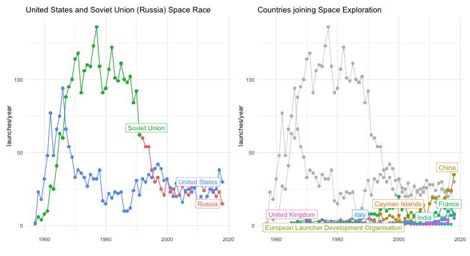
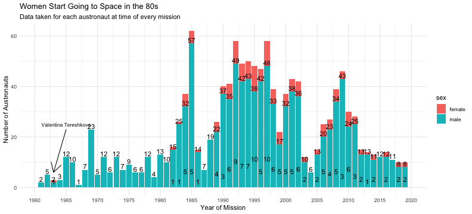
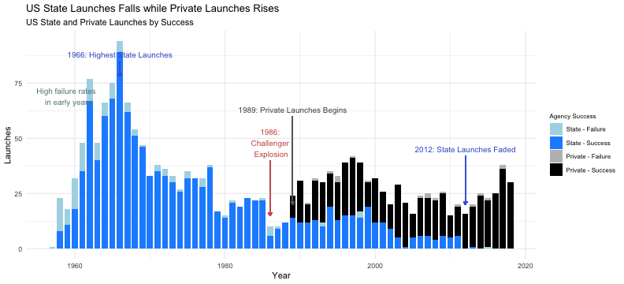
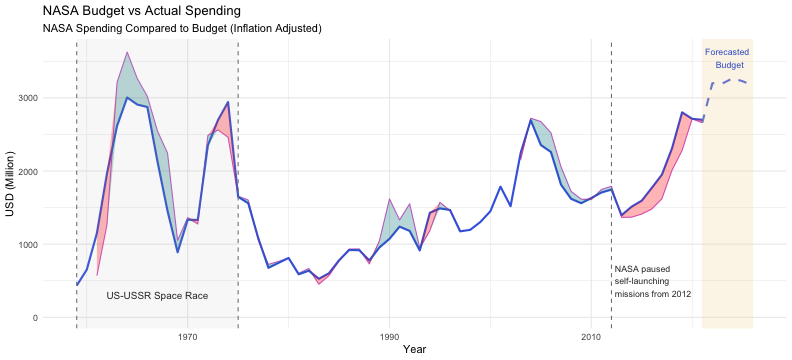

Title Slide
============
title: "To Infinity and Beyond - Stories from Space"
author: Kazmer


Who's going to Space?
=====================



Space Race during the Cold War
==========================


Slide 2
========================================


Slide 3
=====================


Slide 4
========================


```r
gender_count <- astronauts %>% 
    group_by(sex, year_of_mission) %>% 
    count(year_of_mission)

female_male <- gender_count %>% 
  ggplot(aes(x = year_of_mission, y = n, fill = sex)) +
  geom_col() +
  labs(title = "Women Start Going to Space in the 80s",
       subtitle = "Data taken for each austronaut at time of every mission",
       x="Year of Mission",
       y="Number of Austronauts")+
  theme_minimal()

female_male_annotated <- female_male + 
  annotate("text", x = 1965, y = 25, label = "Valentina Tereshkova", size = 3) + 
  annotate("segment", x = 1965, xend = 1963, y = 23,  yend = 6, colour = "black", size = 0.5 , arrow = arrow() )

female_male_annotated + scale_x_continuous(breaks=seq(1960,2020,5)) + 
  geom_text(aes(label = n), vjust = -0.2, size =4)
```



```r
space_race_mission_success_values <- launches %>% 
  group_by(launch_year, country_name, category) %>% 
  summarise(n_missions = n()) %>% 
  mutate(mission_ssuccess_rate = round(n_missions/sum(n_missions)*100,2)) %>% 
  ungroup() %>% 
  filter(category == "O") %>% 
  select(-n_missions, -category)

launches <- launches %>% 
  left_join(space_race_mission_success_values, by = c("country_name" = "country_name","launch_year" = "launch_year"))
```

Slide 5
======================= 


Slide 6
============================


Slide 7
=======================

US Launches

1966: Peaked state launches 1986: Challenger Explosion 1989: Private
commercial Launches starts 2012: Barely any state launches


```r
 launches %>% 
  filter(state_code == "US") %>% 
  mutate(agency_type = ifelse(as.character(agency_type) == "startup", "private", as.character(agency_type))) %>%  # combine startup and private
  group_by(launch_year,agency_type,category) %>% 
  count() %>% 
  unite('type_category',agency_type:category,remove=FALSE) %>% 
  mutate(type_category = case_when(type_category=="state_F" ~ "State - Failure",
                                   type_category=="state_O" ~ "State - Success",
                                   type_category=="private_F" ~ "Private - Failure",
                                   type_category=="private_O" ~ "Private - Success")) %>% 
  ggplot(aes(x=launch_year,y=n,fill = type_category))+
  geom_col(width = 0.8)+
  geom_segment(aes(x = 1966, y = 85, xend = 1966, yend = 78),color = "royalblue",
                  arrow = arrow(length = unit(0.15, "cm")))+
  geom_segment(aes(x = 1986, y = 40, xend = 1986, yend = 15),color = "indianred",
                  arrow = arrow(length = unit(0.15, "cm")))+
  geom_segment(aes(x = 1989, y = 60, xend = 1989, yend = 20),color = "grey40",
                  arrow = arrow(length = unit(0.15, "cm")))+
  geom_segment(aes(x = 2012, y = 42, xend = 2012, yend = 20),color = "royalblue",
                  arrow = arrow(length = unit(0.15, "cm")))+
  annotate("text", x=1966, y=88, label= "1966: Highest State Launches",size=3.5, color="royalblue3") +
  annotate("text", x=1986, y=48, label= "1986:\n Challenger \n Explosion",size=3.5, color="indianred3") +
  annotate("text", x=1989, y=63, label= "1989: Private Launches Begins",size=3.5, color="grey30") +
  annotate("text", x=2012, y=45, label= "2012: State Launches Faded",size=3.5, color="royalblue3") +
  annotate("text", x=1959, y=69, label= "High failure rates \n in early years",size=3.5,color="lightblue4") +
  labs(title = "US State Launches Falls while Private Launches Rises",
       subtitle = "US State and Private Launches by Success",
       x="Year",
       y="Launches",
       fill="Agency Success")+
  theme_minimal()+
  scale_fill_manual("Agency Success", 
                    values = c("State - Failure" = "lightblue", 
                               "State - Success" = "dodgerblue",
                               "Private - Failure" = "grey", 
                               "Private - Success" = "black"))+
  theme(legend.title = element_text( size=8), legend.text=element_text(size=8), legend.background = element_rect(color = NA))
```



General: High spending/budget during Space Race. Drastic decrease of
spending/budget once space is over. US-USSR Space Race: Budget higher
than actual spending (underbudget), NASA is too ambitious 2012 paused
launches: Budget are increasing, ...

Slide 8
=============================



state and private launches success/failure rate (spaceX) NASA fails,
budget cut, blow stuff up cheaper
